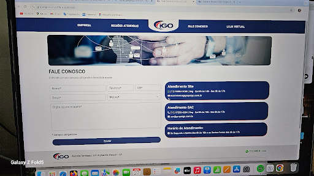
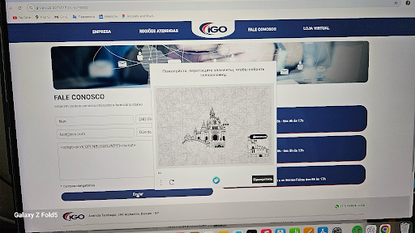
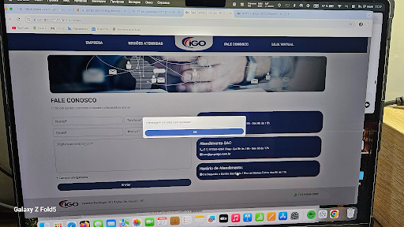
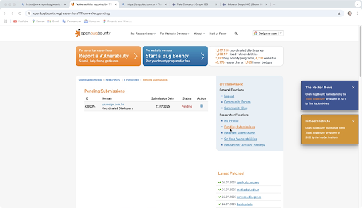

# 🛡️ Stored XSS Vulnerability Report – grupoigo.com.br

## 🗂️ Report Information

- **Title:** Stored XSS in Contact Form (`mensagem` field)
- **Domain:** [grupoigo.com.br](https://grupoigo.com.br)
- **Path:** `/fale-conosco`
- **Type:** Stored Cross-Site Scripting (XSS)
- **Date of Discovery:** 27.07.2025
- **Bug Bounty Platform:** [OpenBugBounty.org](https://www.openbugbounty.org)
- **Status:** 🟠 Pending review

---

## 🔎 Description

A **stored XSS vulnerability** was identified on the contact page of `grupoigo.com.br` via the `mensagem` field of the contact form.  
When submitting a message with a JavaScript payload, the input is stored and later executed in the admin panel or wherever messages are reviewed — without sanitization.

---

## 🧪 Steps to Reproduce

1. Go to: [https://grupoigo.com.br/fale-conosco](https://grupoigo.com.br/fale-conosco)
2. Fill the form with valid data:
   - Nome: `Nan`
   - Telefone: `+380964328936`
   - Email: `test@xss.com`
   - Motivo: `dúvida`
   - Mensagem:
     ```html
     <script>alert('OPENBUGBOUNTY')</script>
     ```
3. Solve CAPTCHA and click **Enviar**.
4. Observe that after submission, the site responds with a confirmation message.
5. The payload is stored and will execute when viewed by an admin.

---

## 📤 Payload

```html
<script>alert('OPENBUGBOUNTY')</script>
```

---

## 🖼️ Screenshots

### 🟢 Screenshot 1: Payload Sent via Form


### 🟢 Screenshot 2: CAPTCHA Challenge Solved


### 🟢 Screenshot 3: Submission Confirmation


### 🟢 Screenshot 4: Report Listed as Pending


---

## 🛠️ Technical Details

- **Affected field:** `mensagem`
- **HTTP method:** POST
- **POST data example:**
```
nome=Nan&telefone=(38)+200964-328936&cep=00000000&email=test@xss.com&motivo=dúvida&mensagem=<script>alert('OPENBUGBOUNTY')</script>
```
- **Content-Type:** `application/x-www-form-urlencoded`
- **Application field (in report):** Custom code

---

## 🔔 Notifications

- **Report submitted via:** OpenBugBounty web interface
- **Twitter contact (reporter):** [@TrunovaTet73725](https://twitter.com/TrunovaTet73725)
- **Disclosure Method:** Coordinated, standard ISO 29147 notification

---

## ✅ Recommendations

To mitigate the vulnerability:

- Implement server-side sanitization (e.g., escape `<`, `>`, `"` in user inputs)
- Use HTML-encoding on message display output
- Apply CSP headers to block inline scripts
- Validate and sanitize all inputs even if behind CAPTCHA

---

## 👤 Researcher

- **Name:** Tetiana Trunova  
- **Twitter:** [@TrunovaTet73725](https://twitter.com/TrunovaTet73725)  
- **OpenBugBounty Profile:** [TTrunovaSec](https://www.openbugbounty.org/researchers/TTrunovaSec)

---

## 🧾 Submission Info

- **Platform ID:** 4230374
- **Submitted:** 27.07.2025
- **Review Status:** Pending
- **Link:** [Pending Submissions](https://www.openbugbounty.org/researchers/TTrunovaSec/pending/)

---

## 🏁 Conclusion

This is a **Stored XSS vulnerability** affecting the live production site of Grupo IGO.  
The issue was responsibly disclosed via OpenBugBounty and will be verified within 5 days. The payload was successfully submitted and saved, confirming the risk of script execution for future viewers (such as admins).

---
